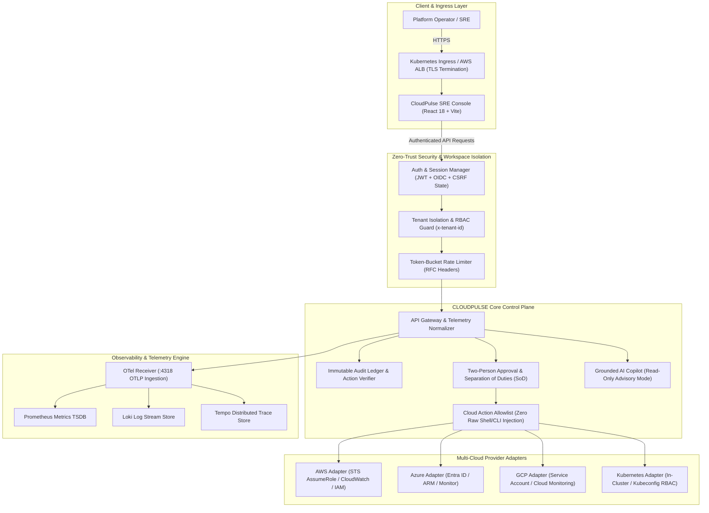

# CLOUDPULSE — Multi-Cloud Observability, Governance, FinOps & SRE Intelligence Platform

> **Enterprise-Grade Multi-Cloud Observability, Zero-Trust Governance, FinOps Intelligence & SRE Control Plane for AWS, Azure, GCP, and Kubernetes.**

[](CHANGELOG.md)
[]()
[](docs/security.md)
[](docs/architecture.md)

---

## 📑 Table of Contents

1. [Executive Summary & Overview](#-executive-summary--overview)
2. [The Multi-Cloud Challenge & Solution](#-the-multi-cloud-challenge--solution)
3. [Core Capability Pillars](#-core-capability-pillars)
4. [Platform Architecture & Control Plane](#-platform-architecture--control-plane)
5. [Supported Cloud Providers & Connection Matrix](#-supported-cloud-providers--connection-matrix)
6. [Zero-Trust Security & Multi-Tenancy](#-zero-trust-security--multi-tenancy)
7. [Real-Data Principle & Truth-in-Labeling](#-real-data-principle--truth-in-labeling)
8. [Controlled Cloud Operations & Safety Guardrails](#-controlled-cloud-operations--safety-guardrails)
9. [Grounded AI Advisory Boundary](#-grounded-ai-advisory-boundary)
10. [Technology Stack & Monorepo Structure](#-technology-stack--monorepo-structure)
11. [Quick Start & Local Development](#-quick-start--local-development)
12. [Deployment & Infrastructure as Code](#-deployment--infrastructure-as-code)
13. [Verification & Quality Assurance](#-verification--quality-assurance)
14. [Known Provider-Dependent Behaviors](#-known-provider-dependent-behaviors)
15. [Resume & Portfolio Project Highlights](#-resume--portfolio-project-highlights)
16. [Master Documentation Directory](#-master-documentation-directory)
17. [Author & Contact](#-author--contact)

---

## 🔭 Executive Summary & Overview

**CLOUDPULSE** is a production-engineered multi-cloud intelligence and operational control plane. It unifies the three pillars of observability (**Metrics, Logs, Distributed Tracing**) with continuous **Cloud Security Posture Management (CSPM)**, **FinOps cost attribution**, **Site Reliability Engineering (SRE) error budgets**, and **governed cloud remediation** across AWS, Microsoft Azure, Google Cloud Platform (GCP), and Kubernetes environments.

Built on strict **NIST SP 800-207 Zero-Trust** principles and cryptographic authorization boundaries, CLOUDPULSE provides enterprise engineering teams with single-pane situational awareness without compromising tenant isolation or credential security.

---

## ⚡ The Multi-Cloud Challenge & Solution

### The Challenge
- **Fragmented Visibility**: Engineering organizations navigate disconnected vendor consoles across AWS, Azure, GCP, and Kubernetes clusters.
- **Alert Fatigue & Hidden Outages**: Isolated alarms fail to correlate root-cause infrastructure changes with downstream business impacts.
- **Uncontrolled Cloud Operations**: Automated scripts risk catastrophic outages through unverified, non-idempotent, or arbitrary command execution.
- **FinOps Blind Spots**: Cloud spending lacks real-time mapping to microservice transactions and unit economics.

### The CLOUDPULSE Solution
- **Unified Telemetry Ingestion**: High-throughput OpenTelemetry (OTLP) engine correlating traces, logs, and Golden Signals.
- **Truth-in-Labeling Engine**: Transparent data provenance distinguishing live provider data from derived estimates and simulations.
- **Controlled Operation Lifecycle**: Two-Person Control, dry-run simulation, allowlisted action schemas, execution guards, and immutable audit trails.
- **Read-Only Grounded AI**: AI advisory copilot strictly bounded by read-only boundaries and cryptographic evidence citation graphs.

---

## 🏛️ Core Capability Pillars

| Capability Area | Implemented Functionality | Operational Status |
| :--- | :--- | :--- |
| **Multi-Cloud Visibility** | Unified telemetry, resource inventory, topology maps across AWS, Azure, GCP, Kubernetes | `IMPLEMENTED` |
| **Observability (Three Pillars)** | OpenTelemetry OTLP ingestion, span waterfall tracing, Prometheus/Loki/Tempo adapters | `IMPLEMENTED` |
| **SRE & Reliability** | SLI/SLO mathematical formulations, multi-window error budgets, MTTA/MTTR tracking | `IMPLEMENTED` |
| **FinOps & Cost Intelligence** | Multi-cloud cost allocation, unit economics ($856.08 MTD baseline), rightsizing simulations | `IMPLEMENTED` |
| **Zero-Trust Security & IAM** | NIST SP 800-207 RBAC, least-privilege analysis, IDOR defense, credential redaction | `IMPLEMENTED` |
| **SOAR Incident Response** | Automated triage, 5-Whys root-cause attribution, defensive playbooks, Post-Incident Reviews | `IMPLEMENTED` |
| **Governance & Policy-as-Code** | Continuous compliance evaluations (SOC 2, ISO 27001, HIPAA, PCI-DSS), drift detection | `IMPLEMENTED` |
| **Service Mesh & Traffic Eng.** | Weighted traffic splitting, canary rollouts, circuit breakers, mTLS service identity | `IMPLEMENTED` |
| **Software Supply Chain (SLSA)**| CycloneDX SBOM parsing, cryptographic signature validation, SLSA Level 3 provenance | `IMPLEMENTED` |
| **Controlled Cloud Operations** | Allowlisted action catalog, separation of duties, pre-flight dry-runs, post-read verification | `IMPLEMENTED` |
| **Grounded AI Copilot** | Advisory-only natural language investigations with strict evidence citation graphs | `IMPLEMENTED` |
| **Disaster Recovery & Chaos** | Mathematical RTO/RPO validation, multi-region failover runbooks, failure injection profiles | `IMPLEMENTED` |

---

## 📐 Platform Architecture & Control Plane

The following diagram illustrates the end-to-end data flow, tenant isolation boundaries, and operational control plane:



---

## ☁️ Supported Cloud Providers & Connection Matrix

| Provider | Authentication Mechanism | Scoped Permissions | Disconnected State Handling |
| :--- | :--- | :--- | :--- |
| **Amazon Web Services (AWS)** | STS Cross-Account `AssumeRole` with External ID | Read-only SecurityAudit, CloudWatchReadOnly, CostExplorerReadOnly | Actionable IAM trust policy generator; honest `NOT_CONNECTED` |
| **Microsoft Azure** | Entra ID (Azure AD) App Registration & Client Credentials | Reader, Monitoring Reader across target Subscription IDs | Step-by-step Azure portal setup guide; honest `NOT_CONNECTED` |
| **Google Cloud (GCP)** | GCP Service Account Key / Workload Identity | Viewer, Monitoring Viewer on designated Project IDs | Service account IAM binding template; honest `NOT_CONNECTED` |
| **Kubernetes (K8s)** | In-Cluster ServiceAccount Token / Kubeconfig | Namespaced RBAC ClusterRole with read-only pods/nodes/services | Cluster discovery guide; honest `NOT_CONNECTED` |

---

## 🛡️ Zero-Trust Security & Multi-Tenancy

CLOUDPULSE implements defense-in-depth compliant with **NIST SP 800-207**:

1. **Strict Multi-Tenant Isolation**: Every API endpoint validates tenant identity through cryptographically signed sessions and explicit `x-tenant-id` scoping. Automated red team tests verify that cross-tenant Insecure Direct Object Reference (IDOR) attempts are blocked with `403 Forbidden`.
2. **Automated Secret Sanitization**: Real-time redaction engine scrubs sensitive patterns (AWS access keys, RSA private keys, passwords, bearer tokens) from error responses, platform logs, and telemetry payloads before persistence or rendering.
3. **Burst Rate Limiting**: Token-bucket rate limiting enforces RFC-compliant headers (`X-RateLimit-Limit`, `X-RateLimit-Remaining`, `X-RateLimit-Reset`) and responds with `429 Too Many Requests` and `Retry-After` during traffic spikes.
4. **OAuth 2.0 & OIDC Security**: Real OpenTelemetry identity federation with cryptographically generated `state` and `nonce` parameters, single-use ticket exchange, and automatic invalidation.

---

## 🏷️ Real-Data Principle & Truth-in-Labeling

CLOUDPULSE strictly enforces the **Real-Data Principle**. Every metric, inventory count, security finding, and topology relationship in the user interface displays an explicit data provenance tag:

- `REAL PROVIDER DATA`: Directly queried from live cloud provider APIs via authenticated credentials.
- `CALCULATED FROM REAL DATA`: Derived mathematically from verified provider telemetry (e.g., SLI/SLO burn rates, MTTR).
- `ESTIMATED`: Statistical approximations (e.g., cloud carbon footprint models, predictive capacity thresholds).
- `PREDICTED`: Machine learning time-series forecasts with confidence intervals (e.g., 30-day FinOps spend forecast).
- `SIMULATED`: Safely simulated fault-injection scenarios (clearly labeled to prevent operational confusion).
- `NOT_CONNECTED`: Truthful display when provider credentials have not been configured. **Zero fake cloud data is generated for connected user paths.**

---

## 🛑 Controlled Cloud Operations & Safety Guardrails

All state-changing cloud operations execute through a rigorous 9-stage pipeline:

$$\text{Request} \longrightarrow \text{Authentication} \longrightarrow \text{Policy-as-Code} \longrightarrow \text{Risk Scoring} \longrightarrow \text{Dry-Run Simulation} \longrightarrow \text{Two-Person Approval} \longrightarrow \text{Execution Guard} \longrightarrow \text{Post-Read Verification} \longrightarrow \text{Audit Ledger}$$

- **Zero Command Injection**: Prohibits raw shell execution (`sh`, `bash`, `cmd`), arbitrary CLI binaries (`aws`, `az`, `gcloud`, `kubectl`), and unvalidated SDK reflection.
- **Two-Person Control (SoD)**: High-risk operations (e.g., cluster scaling, traffic redirection, resource termination) mandate independent peer approval. Requesters are blocked from approving their own actions.
- **Post-Action Read Verification**: Re-reads real provider state after execution to verify expected state convergence before closing the change ticket.

---

## 🤖 Grounded AI Advisory Boundary

The integrated AI Copilot provides operational decision intelligence while enforcing strict safety boundaries:

- **Read-Only Advisory Mode**: The AI agent cannot execute mutating cloud actions, bypass authorization controls, or approve remediation tickets.
- **Evidence Citation Graph**: Every AI-generated finding must reference verifiable evidence (telemetry timestamps, CloudTrail event IDs, Prometheus metrics, or Git commit SHAs).
- **Prompt Injection Defense**: Input normalization and boundary sanitization neutralize indirect prompt injection attacks embedded in log messages or external cloud resource tags.

---

## 💻 Technology Stack & Monorepo Structure

```
cloudpulse/
├── apps/
│   ├── web/                        # React 18 + Vite Enterprise SRE Console
│   └── api/                        # Express + TypeScript Telemetry API Gateway
├── packages/
│   ├── shared/                     # @cloudpulse/shared domain types & schemas
│   ├── instrumentation/            # @cloudpulse/instrumentation OpenTelemetry SDK
│   └── telemetry-engine/           # @cloudpulse/telemetry-engine OTLP Ingestor & TSDBs
├── services/
│   ├── api-gateway/                # Ingress microservice (:4000)
│   ├── order-service/              # Order processing & Saga coordinator (:4001)
│   ├── payment-service/            # Payment gateway & fault simulator (:4002)
│   └── traffic-generator/          # Automated background traffic generator
├── deploy/
│   └── kubernetes/                 # Production Kubernetes manifests (RBAC, NetworkPolicies, HPA)
├── helm/
│   └── cloudpulse/                 # Enterprise Helm Chart (values-dev.yaml, values-prod.yaml)
├── infra/
│   ├── docker-compose.prod.yml     # Multi-container production stack
│   ├── observability/              # Prometheus, Loki, Tempo, OTel Collector configs
│   └── terraform/                  # Modular AWS IaC (VPC, ALB, ECS, EKS, IAM, ECR)
├── .github/workflows/              # Automated CI/CD, validation, and security workflows
└── .env.example                    # Global environment configuration template
```

---

## 🚀 Quick Start & Local Development

### Prerequisites
- Node.js `>= 20.0.0`
- pnpm `>= 9.0.0`

### 1. Installation & Build
```bash
# Clone the repository
git clone https://github.com/jessesilvanus/cloudpulse.git
cd cloudpulse

# Install dependencies with strict lockfile
pnpm install

# Build all workspace packages
pnpm -r build
```

### 2. Launch Local Development Services
```bash
# Start the API Gateway and Web Console
pnpm dev

# (Optional) Start demo microservices mesh and traffic generator
pnpm dev:services
```
- **SRE Console Frontend**: `http://localhost:5173`
- **Telemetry API Gateway**: `http://localhost:3001`
- **Liveness Health Probe**: `http://localhost:3001/health/live`

---

## 🚢 Deployment & Infrastructure as Code

| Target | Deployment Method | Primary Artifacts |
| :--- | :--- | :--- |
| **Docker Compose** | Multi-container local/edge stack | [`infra/docker-compose.prod.yml`](infra/docker-compose.prod.yml) |
| **Kubernetes** | Plain manifests with NetworkPolicies & RBAC | [`deploy/kubernetes/`](deploy/kubernetes/) |
| **Helm** | Parameterized multi-environment chart | [`helm/cloudpulse/`](helm/cloudpulse/) |
| **Amazon Web Services** | Modular Terraform Infrastructure as Code | [`infra/terraform/`](infra/terraform/) |

> **Public Deployment Status**: Local development and container/Kubernetes artifacts are verified and operational. Live public cloud deployment is pending remote host provisioning.

---

## 🧪 Verification & Quality Assurance

```bash
# Run strict TypeScript typechecking across all 10 packages (0 errors)
pnpm -r typecheck

# Run complete automated test suite (769 tests across 146 suites)
pnpm test

# Run deployment smoke test against live API
pnpm --filter @cloudpulse/api exec tsx ../../test/final-deployment-smoke.ts

# Run OAuth and CSRF security verification
pnpm --filter @cloudpulse/api exec tsx ../../test/oauth-comprehensive-verification.ts
```

---

## ⚠️ Known Provider-Dependent Behaviors

- **Single-Instance In-Memory Cache**: The default standalone setup utilizes an in-memory token bucket rate limiter and session store. For horizontally scaled multi-instance clusters, configure a shared Redis backing store.
- **Provider Disconnected States**: When cloud provider credentials are not supplied, the platform displays honest `NOT_CONNECTED` badges and setup guidance rather than fabricating synthetic data.

---

## 💼 Resume & Portfolio Project Highlights

### Project Summary
**CLOUDPULSE — Multi-Cloud Observability, Governance, FinOps & SRE Control Plane**  
*Technologies: TypeScript, React 18, Node.js, Express, OpenTelemetry (OTLP), Prometheus, Loki, Tempo, Docker, Kubernetes, Helm, Terraform, AWS, Azure, GCP*

### Key Engineering Achievements:
- **Architected a Unified Multi-Cloud Control Plane**: Designed and built an enterprise SRE and governance platform aggregating telemetry, compliance, cost, and security across AWS, Azure, GCP, and Kubernetes.
- **High-Throughput OpenTelemetry Engine**: Implemented an OTLP-compliant ingestion pipeline processing Golden Signals, span waterfall traces, and structured log streams with correlation IDs.
- **Zero-Trust Security & Red Team Hardening**: Built NIST SP 800-207 compliant RBAC, cross-tenant IDOR defenses, cryptographic OAuth ticket exchange, and automated credential sanitization verified by a 14-point security test suite.
- **Controlled Cloud Operations & Two-Person Control**: Engineered a governed action lifecycle featuring allowlisted execution schemas, pre-flight dry-runs, peer separation of duties, and post-action state verification.
- **FinOps Unit Economics & Predictive SRE**: Formulated mathematical SLO error budgets, burn rate alerting, and cost-per-transaction unit economics ($856.08 MTD baseline).
- **Automated Verification & Zero Flake Quality**: Authored a 769-test automated suite across 146 test files with 100% pass rate, strict TypeScript compilation (0 errors), and clean-clone build reproducibility.

---

## 📚 Master Documentation Directory

- 🏛️ **[Platform Architecture Specification](docs/architecture.md)** — Core architecture, micro-engine topology, and truth-in-labeling model.
- 🛡️ **[Enterprise Security & Zero-Trust Architecture](docs/security.md)** — Zero-Trust RBAC, Two-Person Control, secret sanitization, and Red Team verification.
- ☁️ **[Multi-Cloud Connection Guide](docs/cloud-connections.md)** — Setup guides and IAM permission matrices for AWS, Azure, GCP, and Kubernetes.
- 🛠️ **[Production Operations & SRE Runbook](docs/operations.md)** — Multi-tier health probing, internal SLO tracking, and FinOps unit economics.
- 🤖 **[Grounded AI Safety Specification](docs/ai-safety.md)** — Read-only AI advisory boundaries, prompt injection defense, and citation graphs.
- 💼 **[Portfolio Briefing & Capability Matrix](docs/portfolio.md)** — Executive briefing, 12-dimensional capability matrix, and engineering metrics.
- 📜 **[Platform Changelog](CHANGELOG.md)** — Complete version history and release notes through v1.0.0.

---

## 👤 Author & Contact

**Jesse Silvanus**  
- **GitHub**: [https://github.com/jessesilvanus](https://github.com/jessesilvanus)  
- **Repository**: [https://github.com/jessesilvanus/cloudpulse](https://github.com/jessesilvanus/cloudpulse)  

---

*CLOUDPULSE v1.0.0 — Engineered with precision for resilient, transparent, and secure multi-cloud operations.*
