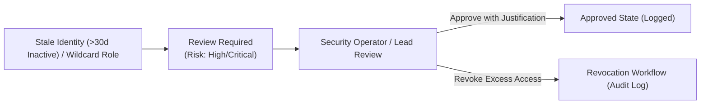

# CLOUDPULSE — Access Reviews & Just-In-Time (JIT) Access

## 1. Access Review Lifecycle

---

## 2. Just-In-Time (JIT) Temporary Access

- **Request Model**: Developers request scoped, time-bound elevated access (`kubectl-exec`, `logs:read-all`).
- **Human Approval**: Requests $>120$ minutes or on Tier-0 production resources require mandatory Administrator approval.
- **Automatic Expiration**: Access tokens expire automatically after the granted duration with zero persistent access leftovers.
