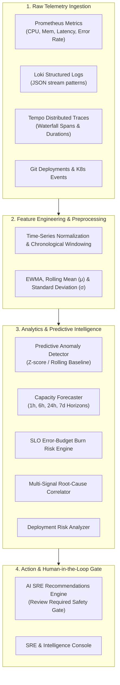

# CLOUDPULSE — AI/ML-Powered SRE & Predictive Cloud Intelligence

## 1. Master Intelligence Architecture

CLOUDPULSE transforms raw multi-modal telemetry into actionable SRE intelligence through a multi-stage analytics and machine learning pipeline:

---

## 2. Core AI Honesty Tenets
1. **No Fake AI or Fabricated Confidence**: Every output explicitly labels its algorithm class (`statistical`, `real_ml`, `heuristic`, `rule_based`, `demo`, or `insufficient_data`).
2. **Explainable Hypotheses**: Root-cause analysis provides explicit evidence arrays and alternative hypotheses.
3. **Human-in-the-Loop**: Destructive operations (rollback, cluster scaling) strictly produce recommendations requiring operator review and approval.
