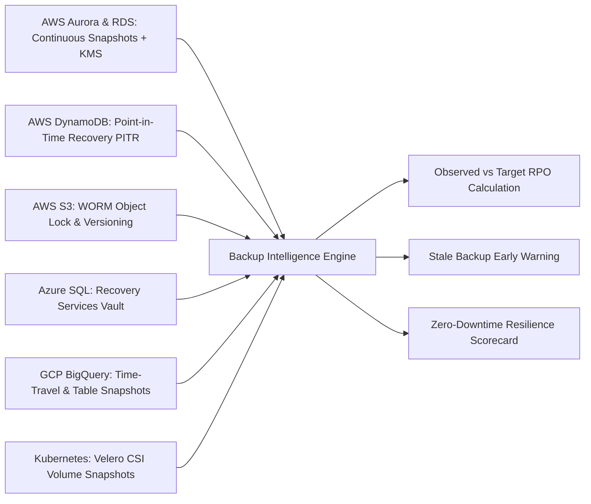

# Backup Intelligence & RTO / RPO Validation Engine

## 1. Multi-Cloud Backup Coverage

CloudPulse continuously tracks backup posture across heterogeneous storage and database systems:

---

## 2. Health & SLA Verification Rules

- **`HEALTHY`**: Last successful backup is within target RPO window; encryption and retention policies satisfied.
- **`STALE`**: Backup age exceeds target RPO window; alert dispatched to SRE channel.
- **`FAILED`**: Backup job failed execution or returned errors; remediation ticket generated.
- **`MISSING`**: Datastore has no active backup policy configured.
- **`IMMUTABLE LOCK`**: Compliance mode WORM lock prevents unauthorized deletion even by root credentials.
