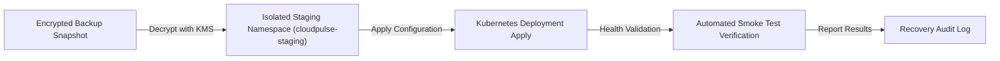

# CLOUDPULSE — Backup & Restore Architecture

## 1. Backup Inventory & Encryption Standards

All infrastructure state and configuration artifacts are backed up with server-side encryption:

| Resource | Resource Type | Schedule | Retention | Encryption | Status | Verification |
| :--- | :--- | :--- | :---: | :---: | :---: | :---: |
| **S3 Terraform State** | `terraform_state` | Continuous | 90 Days | AWS KMS (`SSE-KMS`) | `HEALTHY` | `TESTED` |
| **GitOps K8s Manifests** | `k8s_manifests` | Per Commit | 365 Days | Git SHA / GPG | `HEALTHY` | `TESTED` |
| **Amazon EBS Volumes** | `ebs_volume` | Daily (02:00 UTC) | 30 Days | AWS KMS (`aws/ebs`) | `HEALTHY` | `SIMULATED` |

---

## 2. Restore Testing Workflow

