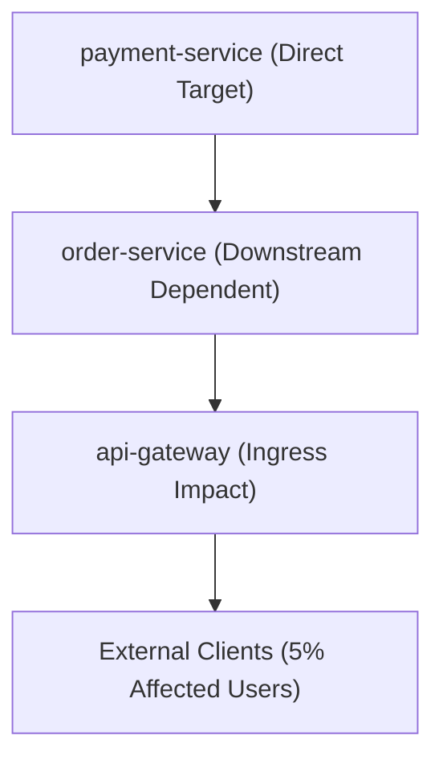

# CLOUDPULSE — Blast Radius Analysis & Dependency Propagation

## 1. Blast Radius Formulation

CLOUDPULSE analyzes upstream and downstream linkages across the Phase 14 dynamic service map before executing chaos experiments:

$$\text{Blast Radius} = \text{Direct Targets} \cup \text{Downstream Dependents} \cup \text{Cascading Network Paths}$$

---

## 2. Risk Level Classification
- **`LOW RISK`**: Internal non-critical service (`traffic-generator`).
- **`MEDIUM RISK`**: Sandboxed backend with active timeout fallbacks (`payment-service`).
- **`HIGH RISK`**: Tier-0 critical component affecting active checkouts (`order-service`).
- **`CRITICAL RISK`**: Core ingress gateway (`api-gateway`).
