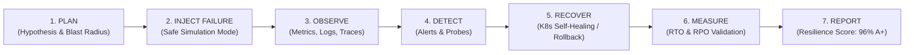

# CLOUDPULSE — Chaos Engineering & Continuous Resilience Validation

## 1. Continuous Resilience Lifecycle

CLOUDPULSE transforms disaster recovery from static assumptions into continuous empirical validation:

---

## 2. Chaos Safety Guarantee
- **Default Mode**: `SIMULATION` / `TEST`.
- **Live Guard**: Live failure injection requires multi-party administrator authorization.
