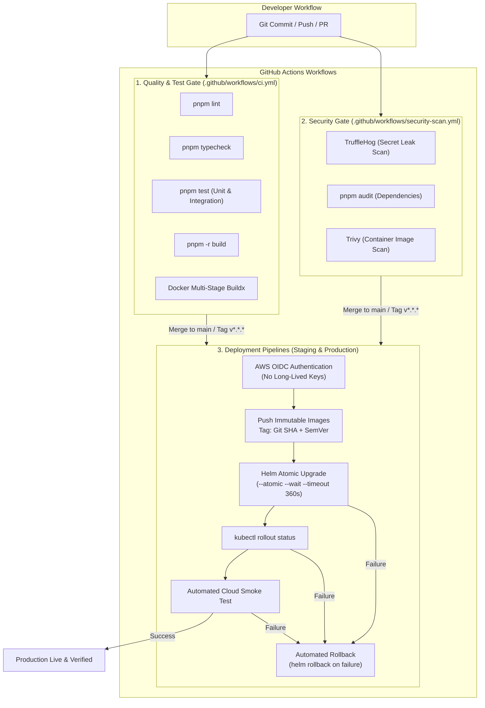

# CLOUDPULSE — CI/CD Pipeline & Automated Release Architecture

## 1. Overview & Objectives

The CLOUDPULSE continuous integration and deployment system provides automated quality gates, security audits, container image builds, vulnerability scanning, and atomic Kubernetes rollouts with automatic rollback on failure.

---

## 2. CI/CD Pipeline Architecture

---

## 3. Workflows Matrix

| Workflow File | Trigger | Environment | Purpose |
| :--- | :--- | :--- | :--- |
| [`.github/workflows/ci.yml`](file:///C:/Users/Dell/.gemini/antigravity/scratch/cloudpulse/.github/workflows/ci.yml) | `push`, `pull_request` | CI Runner | Lint, typecheck, unit tests, monorepo build, Docker build |
| [`.github/workflows/security-scan.yml`](file:///C:/Users/Dell/.gemini/antigravity/scratch/cloudpulse/.github/workflows/security-scan.yml) | `push`, `pull_request`, `schedule` | CI Runner | TruffleHog secrets scan, pnpm audit, Trivy container image scan |
| [`.github/workflows/deploy-staging.yml`](file:///C:/Users/Dell/.gemini/antigravity/scratch/cloudpulse/.github/workflows/deploy-staging.yml) | `push: [main]` | `staging` | Automated CD to staging EKS cluster with Git SHA tags |
| [`.github/workflows/deploy-prod.yml`](file:///C:/Users/Dell/.gemini/antigravity/scratch/cloudpulse/.github/workflows/deploy-prod.yml) | `push: [v*.*.*]`, `workflow_dispatch` | `production` | Production release to EKS with approval gate, smoke tests & auto-rollback |
| [`.github/workflows/k8s-validate.yml`](file:///C:/Users/Dell/.gemini/antigravity/scratch/cloudpulse/.github/workflows/k8s-validate.yml) | `paths: [deploy/kubernetes/**, helm/**]` | CI Runner | Validates Kubernetes manifests with Kubeconform & Helm lint |
| [`.github/workflows/terraform-check.yml`](file:///C:/Users/Dell/.gemini/antigravity/scratch/cloudpulse/.github/workflows/terraform-check.yml) | `paths: [infra/terraform/**]` | CI Runner | `terraform fmt -check`, `terraform init -backend=false`, `terraform validate` |

---

## 4. Immutable Docker Image Tagging

Every image built in the pipeline is tagged immutably using two identifiers:
1. **Git Commit SHA** (`${{ github.sha }}`): Guarantees 100% exact commit-level change traceability.
2. **Semantic Version Tag** (`v0.0.3`): Matches official production releases.

**Mutable `latest` tags are strictly prohibited in deployment manifests**.
