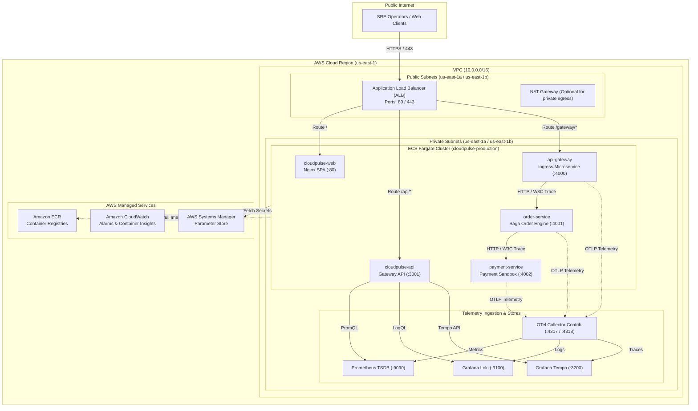

# CLOUDPULSE — Cloud Architecture Design Document

## 1. Overview & Objectives

CLOUDPULSE is architected for high-availability, zero-trust network isolation, observable microservice topologies, and progressive migration to cloud-native platforms.

The production architecture is designed for deployment on **Amazon Web Services (AWS)** using **ECS Fargate**, **Application Load Balancing**, **Least-Privilege IAM**, and **Amazon ECR**.

---

## 2. Target AWS Cloud Topology

---

## 3. Compute Selection: ECS Fargate vs EC2 vs EKS

| Evaluation Dimension | ECS Fargate (Selected) | EC2 Auto Scaling Groups | Amazon EKS (Kubernetes) |
| :--- | :--- | :--- | :--- |
| **Server Management** | **Zero server management** (serverless containers) | Requires OS patching, AMI maintenance, hardening | Control plane managed, worker nodes require management |
| **Operational Overhead** | **Very Low** | Medium-High | High (requires cluster operations, CNI, ingress controllers) |
| **Cost for Small/Medium** | **Pay-per-second** per vCPU/RAM allocation | Fixed hourly instance cost regardless of utilization | **$73/month base cluster fee** + EC2/Fargate node costs |
| **Portfolio / SRE Value** | Demonstrates production AWS container orchestration | Demonstrates traditional infrastructure | Future Phase 4 migration target |
| **Security Isolation** | Kernel-level isolation per task | Shared VM kernel across containers | Shared VM or Fargate profiles |

**Decision**: **ECS Fargate** was chosen for initial AWS deployment because it provides production-grade container orchestration without the $73/month baseline cost overhead of EKS control planes or the operational patching burden of EC2. The containerized workloads are designed symmetrically, allowing a clean transition to Kubernetes (EKS) in subsequent phases.

---

## 4. Security & Network Isolation

1. **Public Subnets**: Contain exclusively the Application Load Balancer and Internet Gateway. No application containers run in public subnets.
2. **Private Subnets**: All ECS tasks, microservices, and telemetry databases run in private subnets with non-routable private IPs.
3. **Security Groups**:
   - `alb-sg`: Permits inbound `80` (HTTP) and `443` (HTTPS) from `0.0.0.0/0`.
   - `ecs-sg`: Restricts ingress exclusively to traffic originating from `alb-sg` and intra-cluster communication on private service ports.
4. **Least-Privilege IAM**:
   - **Task Execution Role**: Grants permissions to pull images from ECR and stream logs to CloudWatch.
   - **Task Role**: Restricts application permissions strictly to reading environment configuration from SSM Parameter Store.
