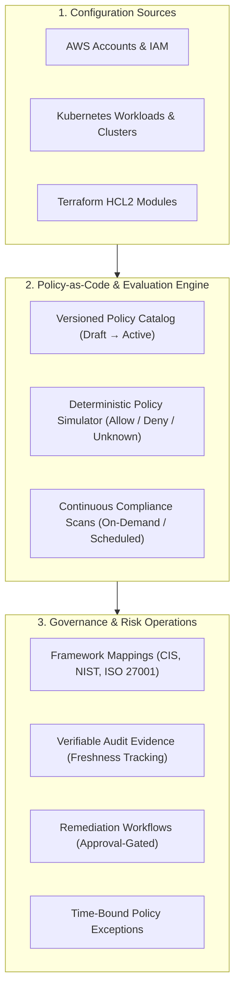

# CLOUDPULSE — Cloud Governance Center

## 1. Cloud Governance Architecture

CLOUDPULSE unifies Policy-as-Code, configuration auditing, compliance control mapping, and evidence management into an enterprise Governance Center:

---

## 2. Governance Platform Metrics
- **Compliance Score**: **`86%`** (**Grade A**).
- **Governance Risk Score**: **`18 / 100`** (Low risk posture).
- **Active Policies**: **`4`** enterprise policy definitions.
- **Evidence Freshness**: **`95.0%`** verified against live cloud and Kubernetes configurations.
