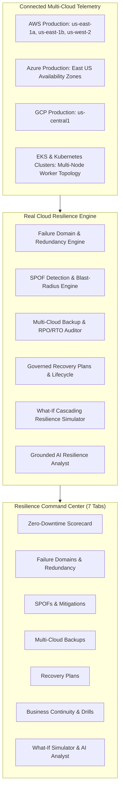

# Real Cloud Resilience & Disaster Recovery Architecture

## 1. Overview & Core Philosophy

The **CLOUDPULSE Real Cloud Resilience & Disaster Recovery Control Plane** delivers comprehensive multi-cloud failure domain intelligence, single-point-of-failure (SPOF) discovery, backup health tracking, and zero-downtime recovery automation across **AWS**, **Azure**, **Google Cloud Platform (GCP)**, and **Kubernetes**.

---

## 2. Core Pillars

### 1. Truth-in-Labeling & Zero Fabrication
- All resilience metrics, failure domain concentration states, and backup health indicators are derived strictly from live multi-cloud infrastructure telemetry or explicit drill logs.
- Unverified backup snapshots or missing replication pipelines are explicitly categorized as `STALE`, `MISSING`, or `UNPROTECTED`.

### 2. Multi-Cloud Failure Domain Analysis
- Evaluates compute, database, network, and storage workloads across Availability Zones (AZs), Regions, Kubernetes Clusters, Worker Nodes, and Provider Managed Services.
- Flags concentrated risk domains where workloads lack cross-zone redundancy or spread constraints.

### 3. Single Point of Failure (SPOF) Elimination
- Continuously pinpoints un-replicated database primary writers, standalone EC2 compute nodes, and single-path load balancer listeners.
- Quantifies estimated downtime, user impact, and financial loss risk per hour for every detected SPOF.

### 4. Backup Intelligence & Observed RPO/RTO
- Audits automated snapshot policies, Point-In-Time Recovery (PITR), WORM Object Locks (compliance mode), and Kubernetes Velero CSI snapshots.
- Calculates true observed RPO against SLA targets, flagging stale backups exceeding tolerance thresholds.

### 5. Governed Multi-Cloud Recovery Plans
- Provides version-controlled, step-by-step failover runbooks with explicit preconditions, automation classifications (`AUTOMATED`, `ASSISTED`, `MANUAL`), risk tiers, and automated rollback actions.
- Integrates with CloudPulse Two-Person Rule approval controls for high-risk failovers.

### 6. Cascading What-If Simulation & Grounded AI Copilot
- Simulates AZ outages, regional blackouts, or storage subsystem failures without impacting production.
- Grounded AI Resilience Analyst features prompt-injection defense and evidence-backed citations.
