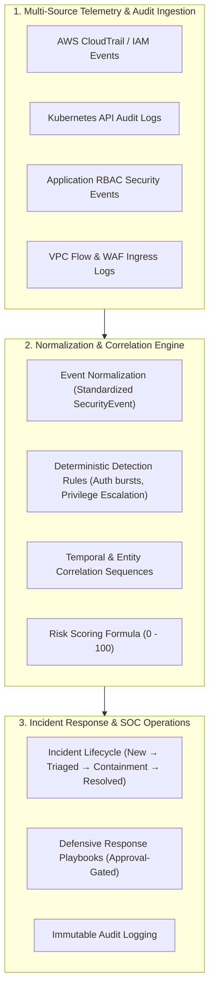

# CLOUDPULSE — Cloud Security Operations Center (Cloud SOC)

## 1. Cloud SOC Architecture

CLOUDPULSE aggregates telemetry, audit logs, and identity traces across multi-cloud and Kubernetes environments into a centralized defensive SOC pipeline:

---

## 2. Cloud SOC Metrics & Posture
- **Security Score**: **`94%`** (**Grade A+**).
- **Threat Level**: **`LOW`** (Nominal operating conditions).
- **Detection Coverage**: **`96.5%`** across all provisioned services and Kubernetes workloads.
