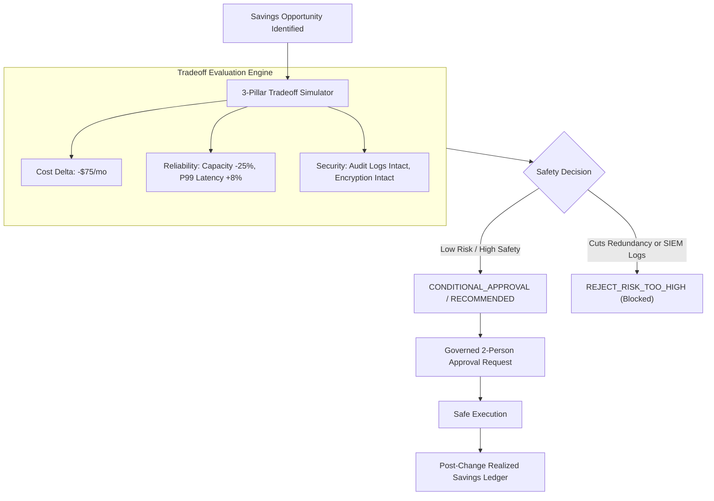

# Cost ↔ Reliability ↔ Security Tradeoffs & Verification Ledger

## 1. The Autonomous Action Safety Principle

Cost reduction recommendations should never be applied indiscriminately. In enterprise environments, aggressive downsizing or deleting resources often induces **reliability outages** or **security vulnerabilities**.

CLOUDPULSE implements a mandatory **3-Pillar Tradeoff Simulation Model**:
- **FinOps Pillar**: Financial savings magnitude ($\Delta \$ / \text{mo}$).
- **SRE & Reliability Pillar**: Headroom reduction %, single-point-of-failure risks, SLO error budget degradation.
- **Security & Compliance Pillar**: Audit log retention truncation, SIEM telemetry loss, encryption downgrades.



---

## 2. Tradeoff Simulation Rules & Safety Bounds

| Proposed Action | Reliability Risk | Security Risk | Recommendation | Reason |
| :--- | :--- | :--- | :--- | :--- |
| **Delete Unattached S3 Bucket** | `NONE` | `NONE` | `RECOMMENDED` | Resource has 0 IOPS and 0 dependencies. Safe to delete. |
| **Scale Down Database vCores (4 $\rightarrow$ 2)** | `MEDIUM` | `NONE` | `CONDITIONAL_APPROVAL` | P99 CPU is 14.2%. Slightly increases analytical query duration (+8%). |
| **Remove Multi-AZ Secondary Replica** | `HIGH` | `NONE` | `REJECT_RISK_TOO_HIGH` | Introduces Single Point of Failure (SPOF). Violates tier-0 reliability policy. |
| **Truncate VPC Flow Log Retention (365d $\rightarrow$ 7d)** | `NONE` | `HIGH` | `REJECT_RISK_TOO_HIGH` | Compromises SOC incident investigation window. Violates SOC 2 audit controls. |

---

## 3. Post-Optimization Realized Savings Ledger

Most cost tools claim savings before they are achieved. CLOUDPULSE verifies savings **post-change** using continuous telemetry and billing feeds:

```typescript
interface VerifiedSavingsRecord {
  opportunityId: string;
  verifiedMonthlySavings: number;
  verifiedAt: string;
  verifiedBy: string;
  notes: string;
}
```

### Verification Status Progression
1. `IDENTIFIED`: Algorithmic recommendation created with calculated confidence.
2. `APPROVED`: Multi-pillar change reviewed and authorized by designated approvers.
3. `PENDING_MEASUREMENT`: Action executed; awaiting billing cycle or telemetry sync window.
4. `VERIFIED_SAVINGS`: Observed post-change bill/usage reduction matches $\ge 90\%$ of expected savings.
5. `PARTIAL_SAVINGS`: Realized reduction is $> 0$ but $< 90\%$ of expected savings.
6. `NO_SAVINGS`: Bill or usage did not decrease (e.g. traffic surged or autoscaling compensated).
