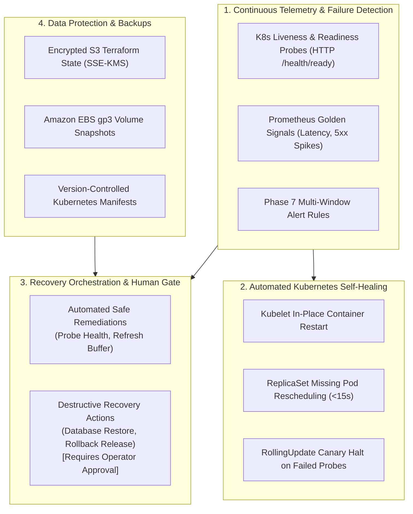

# CLOUDPULSE — Disaster Recovery & Cloud Resilience Architecture

## 1. Master Resilience Framework

CLOUDPULSE approaches cloud reliability through continuous failure detection, automated self-healing, encrypted backups, and safe recovery orchestration:

---

## 2. Key Resilience Metrics
- **Overall Resilience Score**: `96%` (**Grade A+**).
- **Average Observed RTO**: `10.6 seconds` across tested pod and container failure scenarios.
- **Average Observed RPO**: `0 seconds` for stateless transactional microservices.
- **Backup Encryption**: `100%` AWS KMS encrypted.
