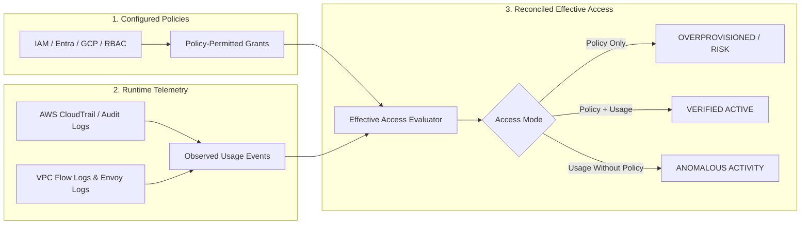

# Effective Access & Least-Privilege Engine

## 1. Overview & Problem Definition

In modern multi-cloud architectures, granted IAM policies and RBAC definitions diverge significantly from actual runtime access requirements. Static permissions accumulate over time, leaving identities with dangerous wildcard rights (`*:*`, `Contributor`, `cluster-admin`) that dramatically expand attack blast radius.

The **CLOUDPULSE Effective Access & Least-Privilege Engine** continuously reconciles **Policy-Permitted Access** against **Observed Runtime Usage**, computing a deterministic Least-Privilege Attainment score and generating scoped down policy recommendations.



---

## 2. Access Mode Classifications

Every effective access rule evaluated by CLOUDPULSE carries an explicit `accessMode`:

| Access Mode | Description | Operational Meaning |
| :--- | :--- | :--- |
| `POLICY_PERMITTED` | Permission granted in IAM/RBAC policy, but **zero observed calls** in trailing 90 days. | Candidate for safe removal or rightsizing. High blast radius risk. |
| `OBSERVED_USAGE` | Runtime activity observed, but granted via indirect or dynamic mechanisms. | Requires policy codification to ensure predictable access. |
| `BOTH` | Permission actively granted by policy **and** actively exercised in production. | Valid least-privilege boundary. Optimal security posture. |

---

## 3. Mathematical Score Calculation

The **Least-Privilege Score** for any identity \( I \) is calculated as:

\[
\text{LeastPrivilegeScore}(I) = \left( \frac{\text{ExercisedActions}(I, 90\text{d})}{\text{GrantedActions}(I)} \right) \times 100 - \text{WildcardPenalty}(I) - \text{StaleCredentialPenalty}(I)
\]

Where:
- **`WildcardPenalty`**: Deducts 25 points if wildcard `*` action is attached to resource `*`.
- **`StaleCredentialPenalty`**: Deducts 15 points if access keys or client secrets exceed 90 days without rotation.

---

## 4. What-If Security Simulation & Blast-Radius Calculation

Before modifying or stripping IAM permissions, operators can simulate the change using the **What-If Security Simulator**:

```json
{
  "actionType": "REVOKE_PERMISSION",
  "targetEntityId": "id-aws-role-payment-svc",
  "proposedChange": "Remove unused action s3:DeleteBucket from PaymentServiceEc2Role"
}
```

### Simulator Output

```json
{
  "simulationStatus": "SIMULATED",
  "securityPostureImpact": {
    "scoreBefore": 86.5,
    "scoreAfter": 89.0,
    "deltaScore": 2.5,
    "riskReduction": "Scoped permissions for id-aws-role-payment-svc to enforce least-privilege boundary."
  },
  "reliabilitySloImpact": {
    "impactRisk": "NONE",
    "sloRisk": "Zero observed calls for s3:DeleteBucket in trailing 90 days across payment-service.",
    "headroomChangePercent": 0
  },
  "requiresTwoPersonApproval": true
}
```

---

## 5. Automated Rightsizing Workflow

1. **Detection**: Engine detects unused permission `s3:DeleteBucket` on `PaymentServiceEc2Role`.
2. **Simulation**: What-If simulator confirms zero SLO impact and +2.5 posture score increase.
3. **Approval**: Generates governed change request requiring two-person review from SecOps Lead.
4. **Execution & Audit**: Modifies IAM policy via IaC automation and records an immutable audit log entry.
