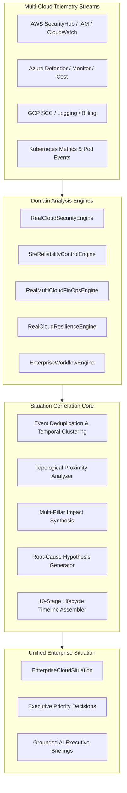

# CLOUDPULSE Enterprise Situation Model & Correlation Engine

## Overview

The **Enterprise Situation Model & Correlation Engine** (`RealGlobalCommandCenterEngine`) serves as the central brain of the CLOUDPULSE Global Cloud Command Center. Rather than forcing operators to inspect disconnected alerts across separate security, reliability, FinOps, resilience, and operational monitoring dashboards, the correlation engine aggregates, deduplicates, and synthesizes multi-cloud telemetry into unified **Enterprise Cloud Situations** (`EnterpriseCloudSituation`).

---

## The 10-Stage Situation Lifecycle

Every correlated enterprise situation is structured across a formal 10-stage causal timeline (`SituationStage`):

1. **`BEFORE`**: Baseline operational state prior to any anomalous event or drift.
2. **`TRIGGER`**: The initiating catalyst (e.g., commit, policy update, cloud provider incident, deployment).
3. **`CHANGE`**: The concrete infrastructure or configuration alteration applied to the cloud estate.
4. **`DETECTION`**: Initial observation by CloudPulse security/reliability/cost sensors.
5. **`IMPACT`**: Observable customer, revenue, SLO, or security exposure manifestations.
6. **`INVESTIGATION`**: Automated cross-pillar correlation, topology graph traversal, and log aggregation.
7. **`DECISION`**: Governed executive decision formulated with risk assessment and trade-offs.
8. **`ACTION`**: Approved, audited remediation or containment action execution.
9. **`VERIFICATION`**: Closed-loop validation verifying recovery metrics and lack of side effects.
10. **`CURRENT_STATE`**: Real-time steady-state verification post-incident resolution.

---

## Correlation & Clustering Algorithm

The correlation engine processes signals using a 4-dimensional distance function:

$$D(e_1, e_2) = w_t \cdot \Delta t(e_1, e_2) + w_{topo} \cdot \text{dist}_{KG}(e_1, e_2) + w_{svc} \cdot \mathbb{I}(svc_1 \neq svc_2) + w_{sev} \cdot |\text{sev}_1 - \text{sev}_2|$$

Where:
- $\Delta t(e_1, e_2)$: Temporal distance in minutes between alert generation.
- $\text{dist}_{KG}(e_1, e_2)$: Graph hop distance in the unified Cloud Knowledge Graph.
- $\mathbb{I}(svc_1 \neq svc_2)$: Service/Application boundary indicator.
- $|\text{sev}_1 - \text{sev}_2|$: Severity divergence penalty.

When $D(e_1, e_2) < \theta_{threshold}$, signals are clustered into the same situation envelope, preventing alert fatigue and illuminating cross-cloud blast radius.

---

## Root Cause Hypothesis Engine

For each synthesized situation, the engine scores competing root cause hypotheses:

$$\text{Confidence}(H_i) = \frac{\sum_{k} w_k \cdot \text{EvidenceScore}(e_k, H_i)}{\sum_{k} w_k} \times (1 - \text{Penalty}_{\text{contradiction}})$$

Each hypothesis includes:
- **Hypothesis Statement**: Clear description of the underlying fault.
- **Probability Score**: Calibrated likelihood ($0.0 - 1.0$).
- **Supporting Evidence**: Concrete links to log lines, configuration diffs, and metric anomalies.
- **Counter-Evidence**: Factors indicating why this hypothesis might be invalid.
- **Suggested Next Step**: Diagnostic query or remediation playbook to validate/resolve.

---

## Truth-in-Labeling & Zero-Fabrication Guarantees

1. **No Synthetic Situations**: Situations are strictly derived from real alerts, metrics, logs, and security findings emitted by live connected providers or verified local fixtures.
2. **Labeled Mathematical Derivations**: All scores (health, severity, risk level, confidence) display their calculation formulas and contributing raw metrics.
3. **Strict AI Execution Boundary**: AI assistance is limited to explanation, summarization, and hypothesis presentation. Any state change requires explicit human approval via the Enterprise Workflow Control Plane (`strictNoActionEnforced: true`).
