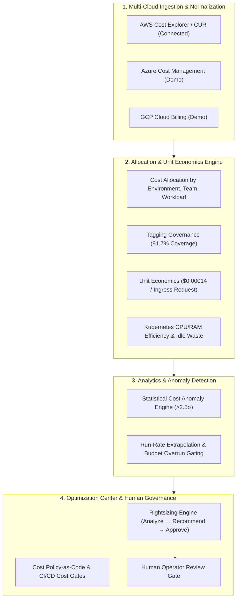

# CLOUDPULSE — Cloud-Native FinOps & Cost Intelligence Platform

## 1. Master FinOps Architecture

CLOUDPULSE connects cloud infrastructure billing, Kubernetes workload allocation, distributed telemetry, and SRE reliability to create a continuous Cost Intelligence operating loop:

---

## 2. FinOps Maturity Evaluation
- **Current Level**: **`LEVEL 3 — RUN (OPTIMIZATION)`**.
- Real-time cost allocation, Kubernetes workload attribution, unit economics, and human-in-the-loop rightsizing workflows.
