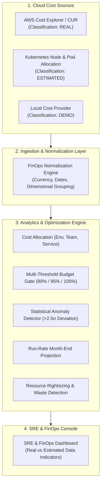

# CLOUDPULSE — Cloud Cost Intelligence & FinOps Operating Model

## 1. FinOps Architecture

CLOUDPULSE provides continuous cloud cost visibility, budget enforcement, and resource optimization across AWS infrastructure and Kubernetes workloads.

---

## 2. FinOps Principles
1. **Truth in Data Classification**: Every cost metric is explicitly tagged as `REAL` (AWS Billing API), `ESTIMATED` (Kubernetes allocation), or `DEMO` (local provider).
2. **Safe Optimization Only**: Rightsizing recommendations are strictly `REVIEW_REQUIRED`; no automated destructive downsizing.
3. **SRE & FinOps Alignment**: Correlating infrastructure cost changes with deployment events, scaling policies, and availability SLOs.
