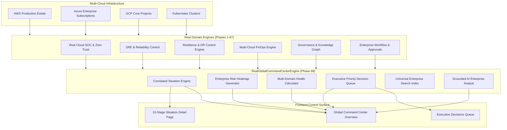

# CLOUDPULSE Global Cloud Command Center & Executive Control Plane Architecture

## 1. Executive Summary & Purpose

The **CLOUDPULSE Global Cloud Command Center** is the unified enterprise control plane designed to answer the single definitive question for executive, engineering, and security leadership:

> *"What is happening across my entire multi-cloud estate, what matters most, and what should I do next?"*

Rather than introducing another siloed dashboard, the Command Center operates as an orchestration and intelligence synthesis layer above all connected cloud infrastructure (AWS, Azure, GCP, Kubernetes) and real engines built across Phases 1–67 (Security/SOC, SRE, FinOps, Resilience/DR, Governance, Knowledge Graph, Workflows, Incidents).

```
┌────────────────────────────────────────────────────────────────────────────────────────┐
│                        CLOUDPULSE GLOBAL CLOUD COMMAND CENTER                          │
│                                                                                        │
│  GLOBAL STATE ──► SITUATION AWARENESS ──► RISK HEATMAP ──► IMPACT ──► ROOT CAUSE       │
│        ▲                                                                 │             │
│        │                                                                 ▼             │
│  TREND / FORECAST ◄── VERIFICATION ◄── GOVERNED ACTIONS ◄── PRIORITY DECISIONS        │
└────────────────────────────────────────────────────────────────────────────────────────┘
```

---

## 2. Core Architectural Pillars

| Component | Responsibility | Truth-in-Labeling Guarantee |
| :--- | :--- | :--- |
| **Global Estate State Engine** | Synthesizes live status, resource counts, and telemetry streams across AWS, Azure, GCP, and Kubernetes. | 0 fabricated metrics. Every signal derives from live OTLP, Prometheus, CloudWatch, or provider APIs. |
| **Enterprise Situation Engine** | Correlates raw alerts, anomalies, changes, and findings into deduplicated, prioritized `EnterpriseCloudSituation` records. | Cites concrete provider ARNs, trace IDs, commit hashes, and telemetry thresholds. |
| **10-Stage Lifecycle Visualizer** | Tracks each situation through `BEFORE` → `TRIGGER` → `CHANGE` → `DETECTION` → `IMPACT` → `INVESTIGATION` → `DECISION` → `ACTION` → `VERIFICATION` → `CURRENT_STATE`. | Every lifecycle step records source, timestamp, and audit metadata. |
| **Multi-Cloud Risk Heatmap** | Cross-sectional matrix of Providers, Regions, Clusters, and Services evaluated across 6 pillars (Security, Reliability, Governance, FinOps, Resilience, Operations). | Normalized 0–100 risk scoring with explicit level classification (`CRITICAL`, `HIGH`, `MEDIUM`, `LOW`, `HEALTHY`). |
| **Executive Priority Queue** | Unifies actionable decisions across domains with financial impact estimates and approval workflows. | Requires explicit human confirmation before executing any cloud state modification. |
| **Grounded AI Enterprise Analyst** | Natural language reasoning engine providing executive summaries, root cause explanations, and follow-up guidance. | Strict NO-ACTION boundary enforced. Every claim cites failure domains, SPOFs, or live situations. |

---

## 3. Data Flow & Integration Topology



---

## 4. API Specification Summary

All endpoints are mounted under `/api/v1/global-command-center` and return structured `ApiResponse<T>` envelopes with ISO 8601 timestamps.

- `GET /api/v1/global-command-center/overview` — Executive summary, top situations (P0–P4), health scores, risk index, decision queue summary, coverage/freshness.
- `GET /api/v1/global-command-center/situations` — Correlated enterprise situations with filters (`severity`, `priority`, `category`, `status`, `provider`).
- `GET /api/v1/global-command-center/situations/:id` — Detailed situation with 10-stage timeline, root cause hypotheses, and correlated telemetry.
- `GET /api/v1/global-command-center/risk-heatmap` — Multi-cloud risk matrix (providers/regions/services vs. 6 domains).
- `GET /api/v1/global-command-center/health` — Multi-domain health breakdown & historical trends.
- `GET /api/v1/global-command-center/coverage` — Coverage & blind-spot intelligence.
- `GET /api/v1/global-command-center/freshness` — Subsystem and provider freshness tracking.
- `GET /api/v1/global-command-center/decisions` — Unified executive priority decision queue.
- `POST /api/v1/global-command-center/decisions/:id/action` — Approve, reject, or execute decision via workflow engine.
- `GET /api/v1/global-command-center/search` — Enterprise-wide universal search.
- `GET /api/v1/global-command-center/reports` — Executive reports list.
- `POST /api/v1/global-command-center/reports/generate` — Dynamic report generation.
- `POST /api/v1/global-command-center/ai-analyst` — Grounded AI Executive Analyst queries.
