# High-Risk Access Paths & Public Exposure Intelligence

## 1. Overview

Cloud breaches rarely occur through single, isolated vulnerabilities; they manifest as **multi-hop attack paths** chaining network misconfigurations, overprovisioned workload identities, and sensitive database access.

The **CLOUDPULSE High-Risk Access Path & Public Exposure Intelligence Engine** combines multi-cloud network topologies, firewall/security group rules, Kubernetes Ingress/LoadBalancers, and IAM authorization graphs to uncover lateral movement attack vectors before adversaries exploit them.

```mermaid
flowchart LR
    Internet((Public Internet)) -->|TCP Port 22 Open (0.0.0.0/0)| SG[AWS Security Group: sg-cloudpulse-ingress-sec]
    SG -->|Inbound Ingress| EC2[EC2 Instance: i-078a1bc49281e7f02]
    EC2 -->|IAM Instance Profile| Role[PaymentServiceEc2Role]
    Role -->|rds-db:connect| DB[(RDS Aurora PostgreSQL: db-orders-aurora-cluster-01)]
```

---

## 2. Multi-Cloud Public Exposure Vectors

CLOUDPULSE aggregates public attack surfaces across cloud boundaries into canonical `PublicExposureEntity` records:

| Exposure Vector | Description | Risk Level | Evidence Captured |
| :--- | :--- | :--- | :--- |
| `SECURITY_GROUP_0_0_0_0` | AWS Security Group rule permitting unrestricted global ingress (`0.0.0.0/0`) on port 22 (SSH) or 3389 (RDP). | `CRITICAL` / `HIGH` | Inbound SG rule ID, attached EC2 network interfaces, VPC subnet type. |
| `PUBLIC_IP` | Azure Public IP associated directly with compute instances or Application Gateway WAF. | `MEDIUM` | Public IP address (e.g. `20.52.18.91`), port mapping, WAF policy status. |
| `K8S_LOADBALANCER` | Kubernetes Service of type `LoadBalancer` provisioning public Cloud Load Balancer. | `MEDIUM` | Service name, namespace, open ports (80, 443), ingress controller binding. |
| `S3_PUBLIC_BUCKET` | AWS S3 bucket ACL or Bucket Policy permitting public anonymous read/write. | `CRITICAL` | S3 Block Public Access configuration, bucket policy statements. |

---

## 3. High-Risk Lateral Movement Path Discovery

The engine executes graph traversal algorithms across connected entities to identify high-risk chains meeting both criteria:
1. **Initial Access Vector**: Direct or indirect reachability from the Public Internet.
2. **Sensitive Asset Impact**: Reachability to databases storing customer PII, encryption keys (KMS), or Kubernetes control plane APIs (`cluster-admin`).

### Confirmed Attack Paths in Production

```mermaid
graph TD
    subgraph Path1["Path 1: Public SSH to Aurora Production Database (CRITICAL)"]
        N1[Internet] --> N2["Security Group (Port 22 open)"]
        N2 --> N3["EC2 Host (payment-gateway-worker)"]
        N3 --> N4["IAM Role: PaymentServiceEc2Role"]
        N4 --> N5["Aurora DB: db-orders-aurora-cluster-01 (PII/Ledger)"]
    end

    subgraph Path2["Path 2: Default Namespace Container to Cluster Takeover (CRITICAL)"]
        K1[Public Ingress] --> K2["Pod debug-tools-pod (default ns)"]
        K2 --> K3["ServiceAccount: temp-debug-sa"]
        K3 --> K4["ClusterRoleBinding: temp-debug-admin-binding"]
        K4 --> K5["Kube-apiserver & etcd Secrets (Full Cluster Admin)"]
    end
```



---

## 4. Grounded AI Security Analyst with Citation Integrity

The **AI Security Analyst** allows SecOps and SRE teams to query threat vectors using natural language while enforcing strict evidence citation and adversarial prompt protection:

- **Evidence Citation Requirement**: Every finding or recommendation must link directly to an observed entity ID (`exp-aws-sg-ssh`, `path-high-risk-01`, `id-k8s-crb-cluster-admin-leak`).
- **Prompt Injection Defense**: Rejects attempts to extract raw cryptographic keys, secret tokens, or system prompt internals under Security Policy Guard `SEC-01`.
- **Actionable Remediation**: Recommends precise IaC/CLI commands and verifies if two-person approval is required.
