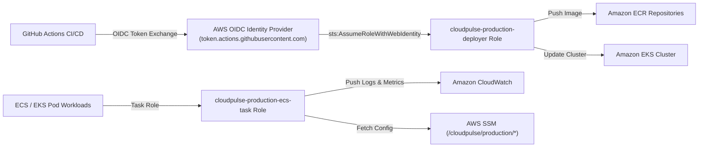

# CLOUDPULSE — AWS IAM & GitHub Actions OIDC Security

## 1. Least-Privilege IAM Architecture

---

## 2. Policy Boundaries
- **Zero AdministratorAccess**: No roles or users grant wildcard `*` permissions.
- **Resource Scoping**: SSM parameter access is strictly restricted to the `/cloudpulse/production/*` namespace prefix.
- **OIDC Condition Keys**: GitHub deployment role requires matching exact repository and environment claims (`repo:cloudpulse/cloudpulse:environment:production`).
