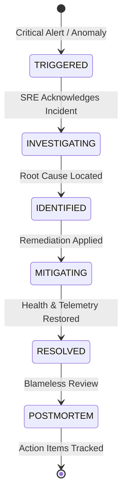

# CLOUDPULSE — Incident Management & Response Lifecycle

## 1. Incident State Machine

---

## 2. Severity Classification (SEV1 to SEV4)

- **SEV1 (Critical Outage)**: Core user journey completely broken (e.g. checkout transaction failure across >10% of requests). Incident commander appointed immediately.
- **SEV2 (Major Degradation)**: Severe latency spike or non-critical service down.
- **SEV3 (Minor Issue)**: Intermittent errors, redundancy reduced.
- **SEV4 (Low Impact)**: Cosmetic bug or internal monitoring glitch.
