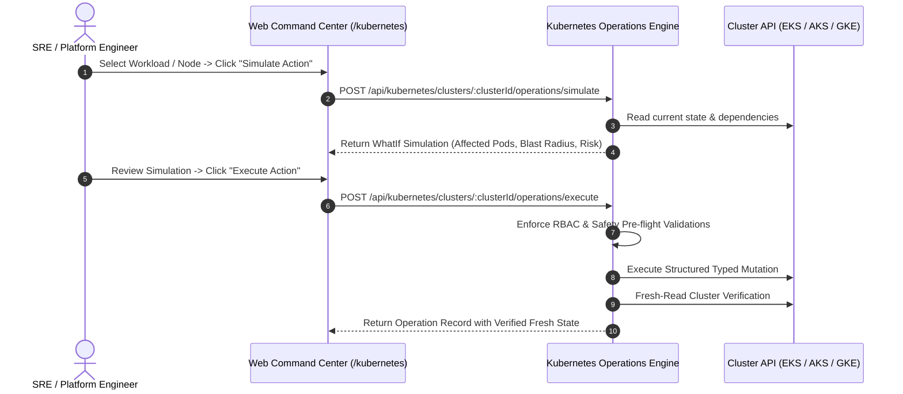

# Kubernetes Operations Control Plane & Safe Remediation (Phase 62)

## 1. Overview & Architectural Principles

CLOUDPULSE provides a governed, secure, and evidence-backed operations control plane for multi-cloud Kubernetes clusters (Amazon EKS, Azure AKS, Google GKE, and Self-Managed Kubernetes).

### Core Operational Invariants:
1. **Zero Raw/Arbitrary `kubectl` Execution**: Arbitrary string command execution and raw shell pipelines are strictly forbidden in production endpoints.
2. **Strict Allowlisted Actions**: Only structurally typed, parameter-validated actions with schema validation are permitted.
3. **Mandatory Non-Mutating Simulation (What-If)**: Any operational intervention can be simulated before execution to calculate impacted pods, nodes, services, and risk levels.
4. **Fresh-Read Verification Guarantee**: After any modifying operation is executed, the control plane immediately reads back fresh state from the cluster API to verify that the desired state was reached.
5. **Full Audit Logging & Tenant Isolation**: Every simulation and execution is linked to the active tenant ID, actor identity, timestamp, and audit trail.

---

## 2. Supported Safe Actions

| Action ID | Name | Target Resource | Description | Safety Level |
| :--- | :--- | :--- | :--- | :--- |
| `restart_workload` | Restart Workload (Rolling) | `apps/v1` Workload (Deployment / DaemonSet / StatefulSet) | Annotates pod template with `kubectl.kubernetes.io/restartedAt` timestamp to trigger zero-downtime rolling restart. | **Safe** |
| `scale_workload` | Scale Workload Replicas | `apps/v1` Workload | Adjusts `spec.replicas` to target scale count with minimum/maximum boundary checks. | **Controlled** |
| `rollback_workload` | Rollback Workload Revision | `apps/v1` Workload | Restores previous replica set revision or pod template image spec in response to bad deployment/CrashLoop. | **Controlled** |
| `cordon_node` | Cordon / Uncordon Node | `core/v1` Node | Sets `spec.unschedulable = true/false` to safely drain or isolate degraded compute nodes without evicting running daemonsets prematurely. | **Privileged** |

---

## 3. Operations Workflow Lifecycle



---

## 4. Non-Mutating What-If Simulation

Before mutating any cluster resource, the engine runs pre-flight safety checks:
- **Blast Radius Calculation**: Determines affected pods, ingresses, and services.
- **Node Capacity Evaluation**: For scaling or cordoning, checks if remaining schedulable nodes have sufficient CPU and Memory.
- **Disruption Budget Auditing**: Validates `PodDisruptionBudgets` (PDB) to avoid violating availability thresholds.

```typescript
export interface KubernetesSimulationResult {
  clusterId: string;
  action: KubernetesSafeAction;
  targetKind: string;
  targetName: string;
  namespace?: string;
  safeToExecute: boolean;
  predictedImpact: string;
  affectedPodsCount: number;
  affectedServices: string[];
  riskLevel: 'LOW' | 'MEDIUM' | 'HIGH' | 'CRITICAL';
  warnings: string[];
  preFlightChecks: {
    checkName: string;
    passed: boolean;
    details: string;
  }[];
}
```

---

## 5. Controlled Execution & Verification

When executing an approved action:
1. The adapter checks connection status and valid authentication (e.g. AWS IAM / OIDC / Azure AD / ServiceAccount token).
2. The mutation is performed strictly via standard Kubernetes REST API endpoints.
3. The engine awaits the API response, then queries the live cluster API to obtain fresh object status (`status.replicas`, `status.conditions`, `spec.unschedulable`).
4. An immutable audit record is stored with status `COMPLETED` or `FAILED`.

```typescript
export interface KubernetesOperation {
  id: string;
  clusterId: string;
  tenantId: string;
  action: KubernetesSafeAction;
  targetKind: string;
  targetName: string;
  namespace?: string;
  parameters?: Record<string, any>;
  status: 'PENDING' | 'SIMULATING' | 'EXECUTING' | 'COMPLETED' | 'FAILED';
  executedBy: string;
  executedAt: string;
  completedAt?: string;
  simulation?: KubernetesSimulationResult;
  resultDetails?: string;
  errorMessage?: string;
  verifiedFreshState?: boolean;
}
```

---

## 6. AI Natural Language Cluster Investigation

The Kubernetes operations control plane integrates with CLOUDPULSE's AI Investigation engine:
- Natural language query interface (`/api/kubernetes/investigate` or via the web copilot).
- Understands cluster health, crashing pods (`CrashLoopBackOff`, `OOMKilled`, `ImagePullBackOff`), node pressure (`MemoryPressure`, `DiskPressure`), and RBAC anomalies.
- Returns evidence-grounded root cause diagnoses, affected resources, and recommended safe allowlisted actions.
