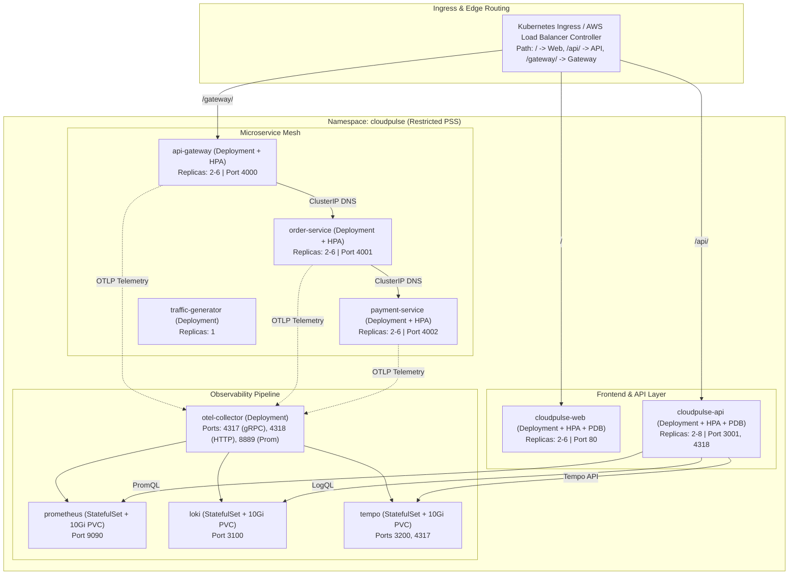

# CLOUDPULSE — Kubernetes Architecture & Orchestration Guide

## 1. Overview & Objectives

CLOUDPULSE is engineered for cloud-native orchestration on **Kubernetes** and **Amazon EKS**, providing zero-downtime rolling deployments, automated horizontal pod autoscaling, zero-trust network isolation, and deep observability across all microservices and telemetry databases.

---

## 2. Kubernetes Resource Topology



---

## 3. Manifest Layout (`deploy/kubernetes/`)

- `namespace.yaml`: Dedicated `cloudpulse` namespace enforcing Kubernetes `restricted` Pod Security Standards.
- `configmap.yaml`: Centralized in-cluster service DNS mappings (`http://*.cloudpulse.svc.cluster.local:<port>`).
- `secrets.example.yaml`: Secure Opaque secret templates.
- `rbac.yaml`: Namespace-scoped `Role` and `ServiceAccount` with no cluster-admin permissions.
- `networkpolicies.yaml`: Zero-trust network firewall rules between pods.
- `web/`, `api/`, `gateway/`, `order/`, `payment/`: Deployments, ClusterIP Services, HPAs, and PDBs.
- `observability/`: OTel Collector Deployment, Prometheus TSDB StatefulSet, Loki StatefulSet, Tempo StatefulSet.
- `ingress/`: Dual-annotated Ingress supporting Nginx Ingress and AWS Load Balancer Controller.

---

## 4. Local Deployment Operations

```bash
# Apply all manifests in order
kubectl apply -f deploy/kubernetes/namespace.yaml
kubectl apply -f deploy/kubernetes/configmap.yaml
kubectl apply -f deploy/kubernetes/secrets.example.yaml
kubectl apply -f deploy/kubernetes/rbac.yaml
kubectl apply -f deploy/kubernetes/networkpolicies.yaml
kubectl apply -f deploy/kubernetes/observability/
kubectl apply -f deploy/kubernetes/payment/
kubectl apply -f deploy/kubernetes/order/
kubectl apply -f deploy/kubernetes/gateway/
kubectl apply -f deploy/kubernetes/api/
kubectl apply -f deploy/kubernetes/web/
kubectl apply -f deploy/kubernetes/traffic-generator/
kubectl apply -f deploy/kubernetes/ingress/

# Verify rollout status
kubectl rollout status deployment/cloudpulse-api -n cloudpulse
kubectl rollout status deployment/cloudpulse-web -n cloudpulse

# Inspect pods and services
kubectl get pods,svc,hpa -n cloudpulse
```

---

## 5. Zero-Downtime Rollout & Rollback

- **Rolling Updates**: Every Deployment specifies `maxSurge: 1` and `maxUnavailable: 0`, guaranteeing zero dropped requests during upgrades.
- **Rollback**:
```bash
kubectl rollout undo deployment/cloudpulse-api -n cloudpulse
```
