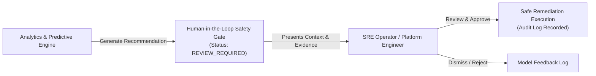

# CLOUDPULSE — Model Evaluation & Human-in-the-Loop Safeguards

## 1. Time-Series Evaluation Metrics

CLOUDPULSE evaluates predictive models chronologically without data leakage:

| Task | Metric | Formula | Target Threshold |
| :--- | :--- | :--- | :---: |
| **Capacity Regression** | **MAE** (Mean Absolute Error) | $\frac{1}{n} \sum |y_i - \hat{y}_i|$ | $< 5\%$ |
| **Capacity Regression** | **RMSE** (Root Mean Squared Error) | $\sqrt{\frac{1}{n} \sum (y_i - \hat{y}_i)^2}$ | $< 8\%$ |
| **Anomaly Detection** | **Precision** | $\frac{\text{TP}}{\text{TP} + \text{FP}}$ | $\ge 90\%$ |
| **Anomaly Detection** | **Recall** | $\frac{\text{TP}}{\text{TP} + \text{FN}}$ | $\ge 95\%$ |

---

## 2. Human-in-the-Loop Architecture

**Zero Silent Production Actions**: High-impact infrastructure mutations (rollback, scaling production replicas, node reboots) are never executed autonomously without explicit human authorization.
