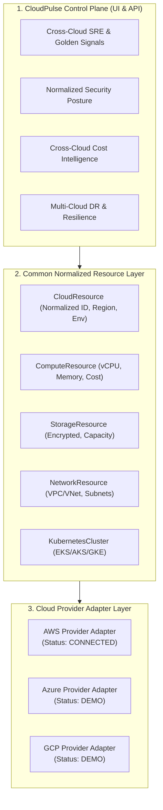

# CLOUDPULSE — Multi-Cloud & Cloud-Agnostic Control Plane

## 1. Multi-Cloud Control Plane Architecture

CLOUDPULSE decouples high-level Site Reliability Engineering, Security, FinOps, and Disaster Recovery from proprietary cloud APIs through an extensible adapter pattern:

---

## 2. Truthful Provider Connection Status
- **AWS**: `CONNECTED` (Active AWS EKS, Spot EC2, S3, ALB infrastructure).
- **Azure**: `DEMO` / `STRUCTURAL_ADAPTER` (Standard_B2s, AKS, Blob storage).
- **GCP**: `DEMO` / `STRUCTURAL_ADAPTER` (e2-medium, GKE, Cloud Storage).
