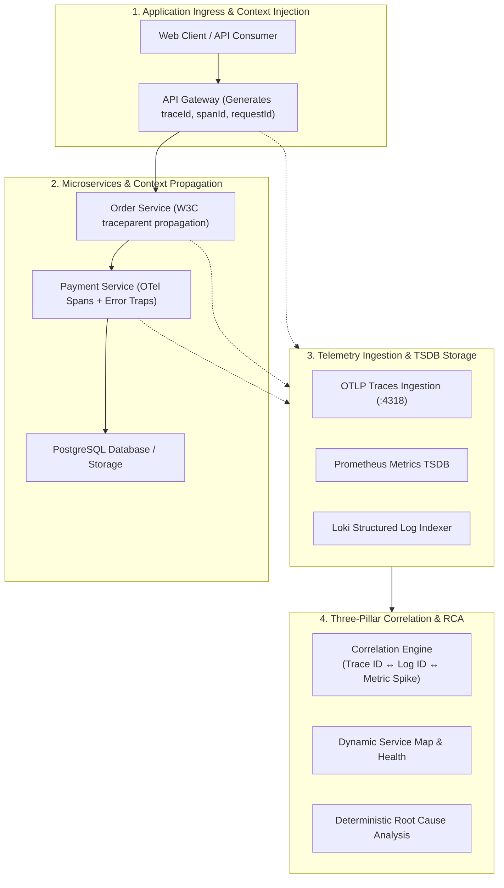

# CLOUDPULSE — Advanced Observability Architecture

## 1. Master Observability Pipeline

CLOUDPULSE implements a unified three-pillar telemetry pipeline connecting OpenTelemetry distributed tracing, Prometheus TSDB metrics, and Grafana Loki structured logs:

---

## 2. Core Pillars & RED/USE Metrics
- **RED Metrics**: Rate (req/s), Errors (%), Duration (P50, P90, P95, P99) per microservice.
- **USE Metrics**: Utilization (%), Saturation (%), Errors (count) across Kubernetes nodes and pods.
