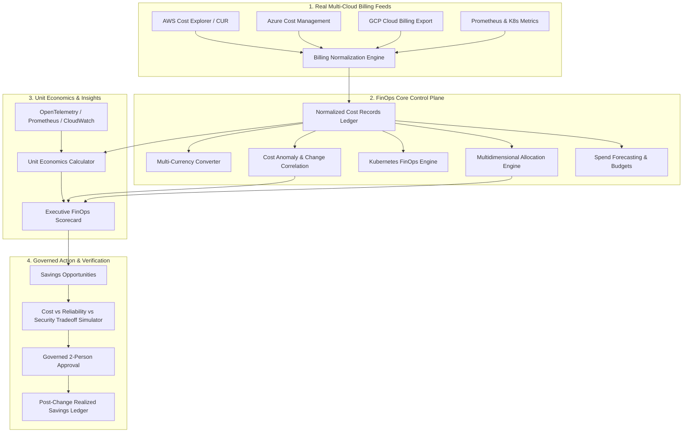

# Real Multi-Cloud FinOps Control Plane Architecture

## 1. Executive Summary & Vision

The **CLOUDPULSE Real Multi-Cloud FinOps Control Plane** provides an authoritative, evidence-grounded financial management and cost governance platform across Amazon Web Services (AWS), Microsoft Azure, Google Cloud Platform (GCP), and Kubernetes clusters.

Unlike legacy cost estimation tools that rely on hypothetical resource price lists or synthetic numbers, CLOUDPULSE adheres strictly to **Truth-in-Labeling** and **Evidence-Based Accounting**:
- Ingests real cloud billing data feeds (AWS Cost Explorer & CUR, Azure Cost Management, Google Cloud Billing Export, and Prometheus Kubernetes node/pod telemetry).
- Enforces explicit provenance tracking (`DIRECT`, `ALLOCATED`, `SHARED`, `CALCULATED`, `ESTIMATED`, `UNKNOWN`).
- Disallows unverified cost claims and flags data freshness or billing sync delays transparently.

---

## 2. Multi-Cloud Billing Normalization

CLOUDPULSE transforms raw provider billing data into canonical `CloudCostRecord` schemas:

| Field | Description | AWS Source | Azure Source | GCP Source | K8s Source |
| :--- | :--- | :--- | :--- | :--- | :--- |
| `id` | Unique Cost Line Item ID | `cost-aws-*` | `cost-azure-*` | `cost-gcp-*` | `cost-k8s-*` |
| `provider` | Cloud Provider Identifier | `AWS` | `AZURE` | `GCP` | `KUBERNETES` |
| `billingAccountId` | Provider Billing Account | AWS Account ID | Azure Sub ID | GCP Billing Acc | EKS/GKE Cluster ARN |
| `service` | Standardized Cloud Service | Amazon RDS / S3 / EC2 | Azure SQL / VM | BigQuery / Cloud Run | Pod Compute / Node |
| `costCategory` | FinOps Category | `COMPUTE`, `STORAGE`, `NETWORK`, `DATABASE`, `MANAGED_SERVICE`, `SHARED_OVERHEAD` |
| `chargeType` | Charge Classification | `USAGE`, `SUBSCRIPTION`, `RESERVATION`, `SAVINGS_PLAN`, `SPOT`, `OVERHEAD` |
| `allocationType`| Allocation Method | `DIRECT`, `ALLOCATED`, `SHARED`, `UNALLOCATED`, `CALCULATED`, `UNKNOWN` |
| `freshness` | Data Recency Status | `REAL_TIME`, `NEAR_REAL_TIME`, `DAILY_BATCH`, `PROVISIONAL`, `FINAL`, `STALE` |

### Truth-in-Labeling Rules
- Untagged or unmapped cloud resources are explicitly marked `allocationType: 'UNKNOWN'` with confidence $< 0.50$ and flagged as missing tags.
- Missing telemetry denominators return `UNIT_ECONOMICS_UNAVAILABLE` rather than defaulting to $\$0.00$.
- Estimated savings from rightsizing are flagged `status: 'IDENTIFIED'`, requiring post-change verification against live billing before transitioning to `status: 'VERIFIED_SAVINGS'`.

---

## 3. Multi-Currency Conversion & Exchange Rate Provenance

For global enterprise organizations operating across currencies (USD, EUR, GBP, JPY, CAD, AUD):
- All currency conversions are marked with `conversionStatus: 'EXACT'`, `CALCULATED`, or `UNKNOWN`.
- Conversions preserve the exact exchange rate source, timestamp, and mathematical basis:
  $$\text{Target Amount} = \frac{\text{Source Amount} \times \text{Source Rate to USD}}{\text{Target Rate to USD}}$$
- Unconfigured or missing exchange rates return `UNKNOWN` status and preserve the raw uncorrupted source amount.

---

## 4. FinOps Data Quality & Governance Scoring

CLOUDPULSE continuously audits cloud financial data quality:
- **Tagging Compliance Score (0–100)**: Evaluates the ratio of fully tagged resources (`CostCenter`, `Environment`, `Team`, `Application`).
- **Unallocated Spend Percentage**: Measures the proportion of cloud spend not mapped to a verified cost center or business unit.
- **Billing Lag Detection**: Flags providers with $> 24\text{hr}$ lag in billing export sync.
