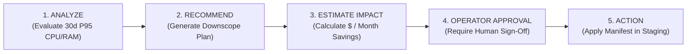

# CLOUDPULSE — Resource Rightsizing & Waste Elimination

## 1. Rightsizing Workflow Governance

To guarantee production safety, CLOUDPULSE enforces strict operator oversight:

---

## 2. Waste Identification Engine
- **Underutilized Workloads**: Workloads running consistently at $<25\%$ of requested CPU or memory.
- **Idle Storage & Disks**: Detached EBS gp3 volumes and untagged ECR container layers older than 30 days.
- **Idle Network Endpoints**: Provisioned NAT Gateways without active subnets.
