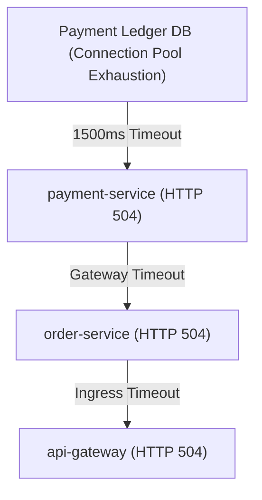

# CLOUDPULSE — Multi-Signal Root Cause Analysis (RCA) & Cascading Failures

## 1. RCA Methodology

CLOUDPULSE does not assert dogmatic certainty; it constructs probabilistic hypotheses grounded in multi-signal evidence:

1. **Distributed Trace Waterfall**: Identifies the exact microservice and child span consuming $>50\%$ of overall transaction latency or returning HTTP 500 error status codes.
2. **Loki Structured Log Clustering**: Identifies error signature surges correlated with the trace `traceId`.
3. **Prometheus Metric TSDB Cross-Correlation**: Compares resource utilization and saturation metrics at the exact moment of failure.
4. **Change Correlation**: Links anomalies to recent deployments, Git commit messages, and Kubernetes configuration updates.

---

## 2. Confidence Rating Scale
- **`HIGH CONFIDENCE` ($>85\%$)**: Supported by concordant signals across all 3 telemetry pillars (Trace timeout + Log exceptions + TSDB latency spike).
- **`MEDIUM CONFIDENCE` ($50\% - 85\%$)**: Supported by 2 telemetry signals.
- **`LOW CONFIDENCE` ($<50\%$)**: Single signal or ambiguous timeline correlation.

---

## 3. Cascading Failure Detection

Identifies upstream root causes to prevent misidentifying downstream symptoms as original faults.

