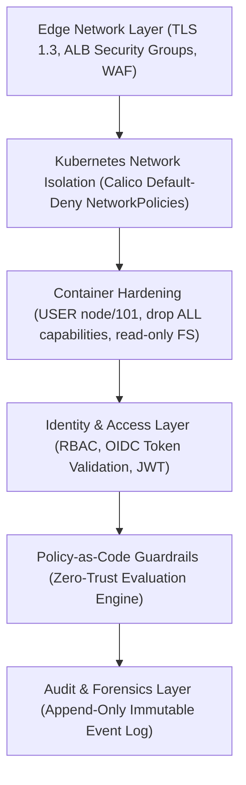

# CLOUDPULSE — Comprehensive Security Architecture

## 1. Defense-in-Depth Control Plane

CLOUDPULSE layers security controls across every level of the application stack:

---

## 2. Workload Identities & Non-Root Execution
All containers enforce:
- Non-root user execution (`USER node` in Node.js, `USER 101` in Nginx).
- Read-only root filesystems where applicable.
- `allowPrivilegeEscalation: false`.
- Dropped Linux capabilities (`drop: ["ALL"]`).
