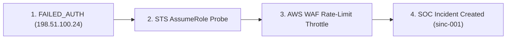

# CLOUDPULSE — Security Correlation & Attack Path Graph

## 1. Multi-Signal Security Sequence Correlation

CLOUDPULSE groups individual security events across time and entity boundaries into structured attack sequences:

---

## 2. Risk Score Formulation

$$\text{Risk Score} = \text{Base Severity} \times \text{Detection Confidence} \times \text{Asset Criticality Multiplier}$$

- **`HIGH CONFIDENCE`**: Deterministic rule match on corroborated audit logs.
- **`MEDIUM CONFIDENCE`**: Statistical anomaly matching baseline deviation.
- **`LOW CONFIDENCE`**: Isolated uncorroborated event.
