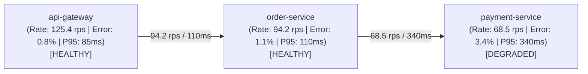

# CLOUDPULSE — Dynamic Service Dependency Map

## 1. Derived Topology & Health Evaluation

The service map is derived dynamically from live distributed trace parent-child relationships and Prometheus metrics:

---

## 2. Health Scoring Formulation
$$\text{ServiceHealth} = \begin{cases} 
\text{CRITICAL} & \text{if ErrorRate} > 5\% \text{ or P95} > 1000\text{ms} \\
\text{DEGRADED} & \text{if ErrorRate} > 2\% \text{ or P95} > 300\text{ms} \\
\text{HEALTHY} & \text{otherwise}
\end{cases}$$
