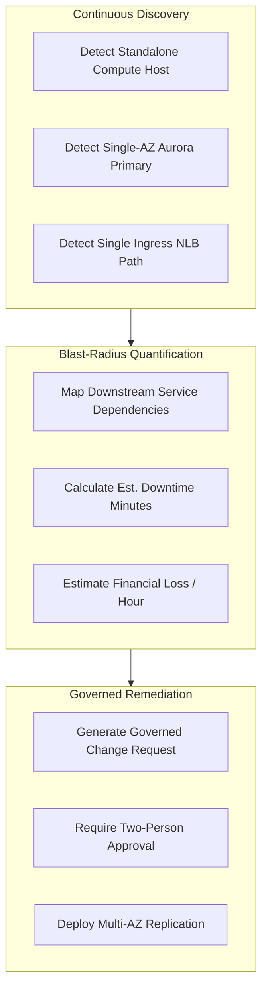

# SPOF, Failure Domains & Multi-Cloud Redundancy Engine

## 1. Failure Domain Hierarchy

CloudPulse categorizes failure domains into hierarchical fault zones:

| Domain Type | Description | Multi-Cloud Examples |
| :--- | :--- | :--- |
| **Availability Zone** | Isolated data center failure domain | AWS `us-east-1a`, Azure East US AZ-1, GCP `us-central1-a` |
| **Region** | Geographic cloud provider boundary | AWS `us-east-1`, Azure `East US`, GCP `us-central1` |
| **Kubernetes Cluster** | Orchestrator control plane fault boundary | AWS EKS `prod-eks-us-east-1`, Azure AKS, GCP GKE |
| **Worker Node** | Physical or virtual compute host | Kubernetes worker node `prod-eks-worker-01` |
| **Storage Subsystem** | Block, object, or relational store | Amazon EBS, Aurora PostgreSQL, Azure Blob, BigQuery |
| **Network Segment** | Ingress, VPC subnet, or load balancer | AWS Network LoadBalancer, Azure App Gateway WAF |

---

## 2. SPOF Detection & Blast-Radius Quantification

### Risk Priority Classification:
- **P0 (Critical)**: Standalone compute nodes or datastores with zero automated failover, causing immediate customer checkout disruption (Financial Risk > $40,000/hr).
- **P1 (High)**: Single-AZ database writer with cross-AZ replica requiring failover promotion (Downtime: 2–5 min).
- **P2 (Medium)**: Single network ingress route without cross-region DNS load balancing.
