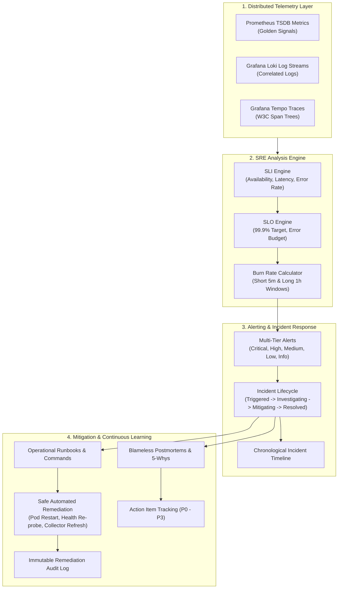

# CLOUDPULSE — Site Reliability Engineering (SRE) Architecture

## 1. Overview & Vision
CLOUDPULSE transforms raw distributed telemetry (Metrics, Logs, Traces) into actionable SRE intelligence, enabling automated error budget tracking, multi-window burn rate alerting, structured incident response, operational runbooks, and continuous postmortem learning.

---

## 2. SRE Lifecycle Flow

---

## 3. Four Golden Signals
1. **Latency**: Round-trip request processing time tracked at P50, P95, and P99 percentiles.
2. **Traffic (Throughput)**: Requests per second (RPS) handled by the ingress and microservice mesh.
3. **Errors**: Ratio of HTTP 5xx responses or unhandled exceptions against total requests.
4. **Saturation**: CPU utilization percentage and memory usage across container tasks and worker nodes.
