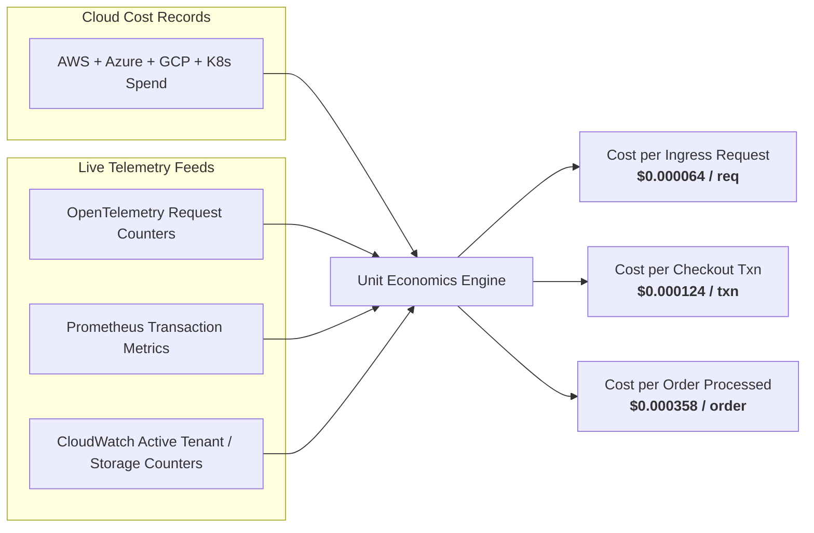

# Unit Economics & Cost Allocation Engine

## 1. Unit Economics Philosophy & Mathematical Grounding

In modern engineering organizations, total cloud spend alone does not indicate cost efficiency. A growing cloud bill is healthy if revenue or customer transaction volume is growing faster. Conversely, a flat cloud bill is inefficient if transaction volume dropped by 50%.

CLOUDPULSE couples normalized cloud billing records with **real operational telemetry denominators** collected from OpenTelemetry traces, Prometheus metrics, and CloudWatch statistics:

$$\text{Unit Cost} = \frac{\sum \text{Allocated Monthly Infrastructure Cost}}{\text{Live Telemetry Denominator Count}}$$

---

## 2. Supported Denominators & Provenance

| Service | Telemetry Denominator Source | Metric Name | Unit Formula |
| :--- | :--- | :--- | :--- |
| `API Gateway` | OpenTelemetry Traces | `http.server.requests` | $\$ / \text{HTTP Request}$ |
| `Payment Service` | Prometheus Counter | `payments_processed_total` | $\$ / \text{Payment Transaction}$ |
| `Order Service` | Prometheus Counter | `orders_completed_total` | $\$ / \text{Order Executed}$ |
| `User Auth & Identity`| OpenTelemetry Traces | `auth_validations_total` | $\$ / \text{Auth Validation}$ |
| `Storage & Cold Archive`| CloudWatch Metrics | `S3.NumberOfObjects` | $\$ / \text{GB Stored}$ |

### Handling Missing Denominators
If a service does not emit telemetry or the metric stream is disconnected, CLOUDPULSE outputs:
- `unitCost: null`
- `status: 'UNIT_ECONOMICS_UNAVAILABLE'`
- `confidence: 0.0`
- `notes: 'Metric stream missing. Configure OpenTelemetry counter to enable unit economics.'`

This avoids fabricating fictitious unit costs or dividing by zero.

---

## 3. Multidimensional Cost Allocation & Showback/Chargeback

CLOUDPULSE allocates 100% of cloud spend across four distinct organizational dimensions:
1. **Team Ownership**: Maps infrastructure to engineering teams (`Site Reliability Engineering`, `Cloud Security & SOC`, `Platform & Kubernetes Engineering`, `Checkout Services`, `Core Data`).
2. **Environment Tier**: Segregates `production`, `staging`, `development`, `canary`, and `sandbox`.
3. **Category Type**: Groups spend into `COMPUTE`, `STORAGE`, `NETWORK`, `DATABASE`, `MANAGED_SERVICE`, `SHARED_OVERHEAD`.
4. **Cost Center Entity**: Enables finance chargeback against enterprise general ledger codes (`CC-ENG-PROD`, `CC-ENG-DATA`, `CC-SEC-OPS`).

---

## 4. Kubernetes FinOps: Node, Pod, and Shared Overhead Allocation

Kubernetes multi-tenancy introduces shared compute complexity. CLOUDPULSE calculates:
- **Direct Pod Cost**: Computed from pod CPU/Memory requests vs node hourly price.
- **Shared Cluster Overhead**: Network ingress controllers, monitoring agents (Prometheus/FluentBit), and daemonsets distributed proportionately across tenant workloads.
- **Overprovisioned Waste**:
  $$\text{Waste Monthly} = \text{Allocated Monthly Cost} \times \left(1 - \frac{1}{\text{CPU Request vs Actual Ratio}}\right)$$
