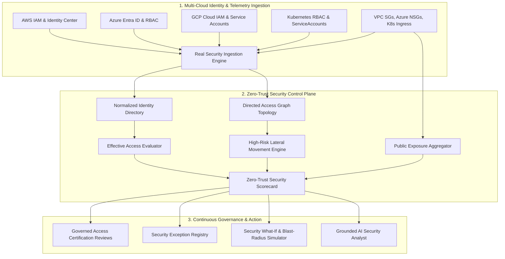
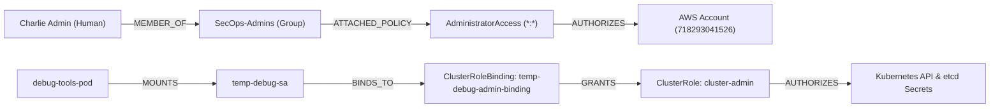

# Zero-Trust Cloud Security & Identity Architecture

## 1. Executive Summary & Principles

The **CLOUDPULSE Zero-Trust Security & Identity Control Plane** delivers an evidence-grounded, continuous evaluation platform unifying identities, permissions, network ingress, multi-cloud resources, and active threat postures across Amazon Web Services (AWS), Microsoft Azure, Google Cloud Platform (GCP), and Kubernetes clusters.

Adhering strictly to NIST SP 800-207 and Zero-Trust tenets:
1. **Never Trust, Always Verify**: Every identity (human, service account, instance role, OIDC federated deployer) is continuously authenticated and authorized based on real telemetry, not static perimeter assumptions.
2. **Enforce Least Privilege**: Continuous delta analysis between policy grants (`POLICY_PERMITTED`) and observed runtime usage (`OBSERVED_USAGE`), eliminating dormant privileges and wildcard grants.
3. **Assume Breach**: Deep attack path discovery graphing lateral movement vectors from exposed public endpoints to sensitive data tiers.
4. **Governed Decision & Compensating Controls**: All high-risk policy alterations, emergency access grants, and security exceptions are recorded with explicit expiration, audit logging, and two-person approval.
5. **Truth-in-Labeling & Grounded AI**: Security metrics cite real cloud evidence with confidence ratings (`CONFIRMED`, `DERIVED`, `INFERRED`) and defensive prompt-injection guards.

---

## 2. Multi-Cloud Identity Normalization

CLOUDPULSE maps heterogeneous cloud identity models into a unified `RealCloudIdentity` schema:

| Dimension | AWS IAM | Azure Entra ID | GCP IAM | Kubernetes RBAC |
| :--- | :--- | :--- | :--- | :--- |
| **Human Identity** | IAM User / SSO Principal | Entra ID User (`UPN`) | Google Account / Workspace User | X.509 User / OIDC Identity |
| **Service Identity** | IAM Role / Instance Profile | Service Principal (`AppId`) | Service Account (`gserviceaccount.com`) | ServiceAccount (`system:serviceaccount`) |
| **Federated Deployer**| GitHub Actions OIDC Role | Workload Identity Federation | Workload Identity Federation | Projected Token / IRSA |
| **Privilege Level** | `ADMIN`, `OPERATOR`, `DEVELOPER`, `AUDITOR`, `LIMITED` based on attached policies and effective permissions |
| **Credential Hygiene**| Access Key Age (days), Multiple Active Keys, Stale Credential Flag, Admin Wildcard (`*:*`) detection |

### Truthful Evidence Fields

- `freshness`: Indicates whether the identity telemetry was freshly polled (`FRESH`, `STALE`, `UNKNOWN`).
- `confidence`: Mathematical assurance level (1.0 for direct provider API responses).
- `leastPrivilegeScore`: Numerical attainment (0–100%) indicating how tightly granted policies match observed usage.

---

## 3. Directed Access Relationship Graph

Access permissions are modeled as directed graph edges connecting sources to targets with verified provenance:

### Edge Classifications & Provenance

1. **`CONFIRMED`**: Directly verified via Cloud Provider API calls (e.g. AWS `GetGroupMembership`, Kube-apiserver `ClusterRoleBinding`).
2. **`DERIVED`**: Computed through deterministic policy logic (e.g. cross-account trust assumption evaluation).
3. **`INFERRED`**: Correlated from runtime telemetry or cloud audit logs with documented confidence intervals.

---

## 4. Continuous Control Effectiveness & Frameworks

The control plane continuously evaluates control adherence against industry security standards:

- **NIST SP 800-53 (AC-6 Least Privilege)**: Evaluates excessive permissions, unused IAM actions, and wildcard role attachments.
- **CIS AWS Foundations Benchmark 4.1**: Detects open security groups permitting global `0.0.0.0/0` ingress on management ports (22, 3389).
- **CIS Kubernetes Benchmark 5.1.1**: Identifies cluster-admin ClusterRoleBindings in non-system namespaces.
- **SOC 2 Type II (CC6.1 Access Control)**: Enforces 100% MFA compliance for human operators and active credential rotation.

---

## 5. Security Exceptions & Governed Review Workflows

When operational reality necessitates temporary deviations from zero-trust baselines:
1. **Compensating Controls Required**: Exceptions cannot be granted without documented, active compensating controls (e.g. static VPN IP restrictions, enhanced CloudTrail session recording, Teleport bastions).
2. **Definite Expiration**: All exceptions enforce an immutable `expiresAt` timestamp and are marked `isExpired: true` automatically.
3. **Separation of Duties**: Reviewers cannot approve their own entitlement or access requests.
