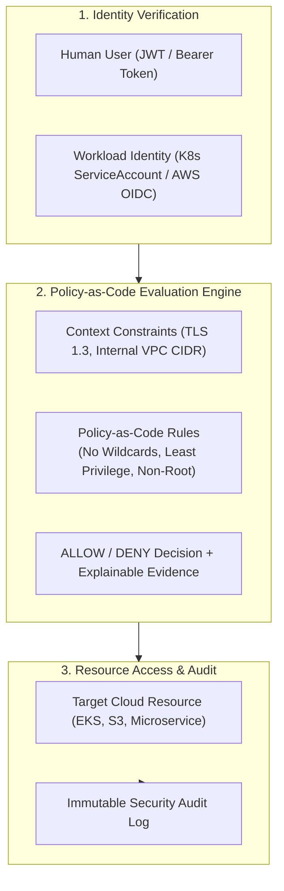

# CLOUDPULSE — Zero-Trust Security Architecture

## 1. Master Zero-Trust Model

CLOUDPULSE adheres to the fundamental Zero-Trust premise: **Never Trust, Always Verify**. Every request across user interfaces, microservices, and background jobs is authenticated, authorized, and audited:

---

## 2. Core Zero-Trust Pillars
1. **Explicit Identity Verification**: Every human and workload identity must authenticate with cryptographically signed tokens.
2. **Least Privilege Enforcement**: Workloads are granted only the minimum permissions required for active transaction paths.
3. **Continuous Access Reviews**: Stale permissions and long-lived credentials are automatically flagged for review.
